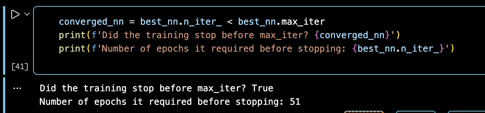
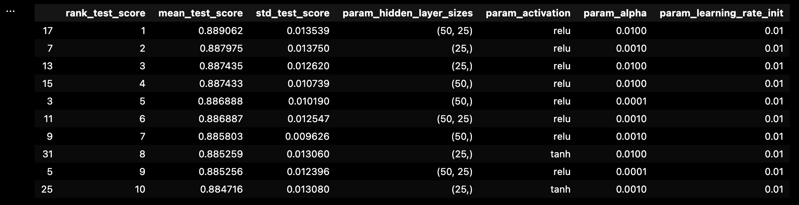
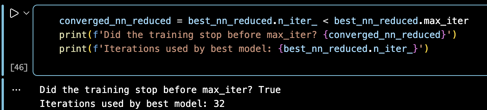
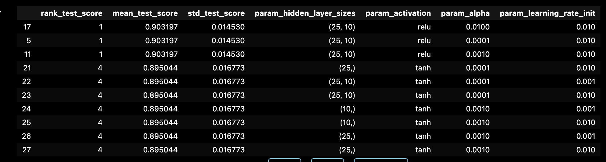
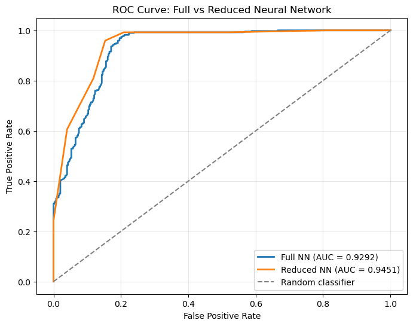
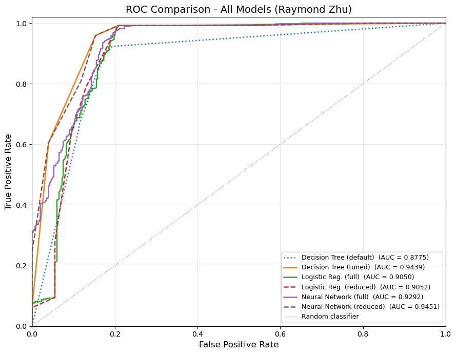

# Task 4. Neural Networks

## 4.1 Describe what additional processing was required on this dataset to be used for neural network modelling

The general preprocessing steps, including missing-value imputation, target creation, removal of noisy columns, one-hot encoding, and high-correlation removal, were completed in Task 1. The additional preprocessing for neural network modelling focused on preparing the already-cleaned feature matrix for `MLPClassifier`.

Neural networks require numeric inputs and are sensitive to feature scale because training uses gradient-based optimisation. Therefore, the continuous numeric variables were standardised, while the one-hot encoded dummy variables were kept as 0/1 values.

| Neural network preprocessing | Implementation in this study | Why it was needed |
|---|---|---|
| Use the cleaned numeric feature matrix from Task 1 | The neural network used the already one-hot encoded and correlation-filtered predictors from Task 1 | `MLPClassifier` requires numeric input variables |
| Standardise continuous numeric variables | Non-binary numeric variables such as rainfall, temperature, humidity, seed rate, fertiliser, and pesticide variables were scaled with `StandardScaler` | Neural networks use gradient-based optimisation, so scaling prevents large-scale variables from dominating weight updates |
| Keep dummy variables as 0/1 and avoid leakage | One-hot encoded variables were kept as binary values; the scaler was fitted on `X_train` only and then applied to `X_test` | Dummy variables are already on a consistent scale, and fitting the scaler only on training data prevents test-set leakage |

## 4.2 Full Neural Network Tuned with GridSearchCV

### 4.2.1 Explain the parameters in building this model, e.g., network architecture, iterations, activation function, etc. Explain your choice of hyperparameters to search, and the chosen search range(s)?

Full neural network used all features as input, which is nearly 50 input variables. The model function was `MLPClassifier`, using the `adam` solver, `max_iter=1000`, `early_stopping=True`, and `n_iter_no_change=20`.

GridSearchCV was used to tune the model because neural networks are sensitive to hyperparameters such as hidden-layer size, activation function, regularisation strength, and learning rate.

| Hyperparameter       | Search values                | Reason                                                       |
| -------------------- | ---------------------------- | ------------------------------------------------------------ |
| `hidden_layer_sizes` | `(25,)`, `(50,)`, `(50, 25)` | Tested one smaller layer, one medium layer, and a two-layer architecture |
| `activation`         | `relu`, `tanh`               | Compared two common nonlinear activation functions           |
| `alpha`              | `0.0001`, `0.001`, `0.01`    | Tested different L2 regularisation strengths to control overfitting |
| `learning_rate_init` | `0.001`, `0.01`              | Compared a stable default learning rate with a faster larger learning rate |

The activation functions tested were `relu` and `tanh`. `relu` was included because it is commonly used and trains efficiently in hidden layers, while `tanh` was included as an alternative nonlinear activation for comparison. The model was allowed to train for up to 1000 iterations, but early stopping was used so training stopped when t he performance is no longer improved.

### 4.2.2 What is the classification accuracy of the training and test datasets?

The full neural network used the following settings and had following performance:

| Item                           | Value           |
| ------------------------------ | --------------- |
| Model                          | `MLPClassifier` |
| Input variables                | 50              |
| Best hidden-layer architecture | `(50, 25)`      |
| Best activation                | `relu`          |
| Best alpha                     | `0.01`          |
| Best learning rate init        | `0.01`          |
| Training accuracy              | `0.9119`        |
| Test accuracy                  | `0.8606`        |
| Train-test accuracy gap        | `0.0513`        |
| AUC                            | `0.9292`        |
| Iterations used                | 51              |

### 4.2.3 Did the training process converge and result in the best model?

Yes, this full neural network stopped after 51 iterations, before reaching `max_iter=1000`. Since `early_stopping=True` was used, which means the training process stopped when the performance is no longer improved. And GridSearchCV selected the best estimator as well.

And the GridSearchCV outcome shows as:

### 4.2.4 Do you see any sign of over-fitting?

The train-test accuracy gap was 0.0513, so the full neural network showed some evidence of overfitting. The training accuracy was higher than the test accuracy, which suggests the model fitted the training data better than unseen test data. However, the gap was not extreme.

## 4.3 Reduced Feature Neural Network

### 4.3.1 Did feature selection favour the outcome? Report the changes in the network architecture. What inputs are being used as the network input?

The reduced neural network used features selected from the tuned decision tree in Task 2 using `SelectFromModel`. This reduced the input set from 50 variables to 2 variables: `Urea_40Days` and `Variety_delux ponni`.

Because fewer input variables were used, the architecture search was changed from `(25,)`, `(50,)`, and `(50, 25)` in the full model to smaller hidden-layer structures in the reduced model.

| Hyperparameter | Search values | Reason |
|---|---|---|
| `hidden_layer_sizes` | `(10,)`, `(25,)`, `(25, 10)` | Tested smaller network structures because the reduced model had only 2 input variables |
| `activation` | `relu`, `tanh` | Compared two common nonlinear activation functions, the same as the full neural network |
| `alpha` | `0.0001`, `0.001`, `0.01` | Tested different L2 regularisation strengths to control overfitting |
| `learning_rate_init` | `0.001`, `0.01` | Compared a stable default learning rate with a faster larger learning rate |

### 4.3.2 What is the classification accuracy on the training and test datasets?

The reduced feature neural network used the following settings and had following performance:

| Item                           | Value                                      |
| ------------------------------ | ------------------------------------------ |
| Model                          | `MLPClassifier`                            |
| Input variables                | 2                                          |
| Feature selection method       | Tuned decision tree with `SelectFromModel` |
| Selected variables             | `Urea_40Days`, `Variety_delux ponni`       |
| Best hidden-layer architecture | `(25, 10)`                                 |
| Best activation                | `relu`                                     |
| Best alpha                     | `0.0001`                                   |
| Best learning rate init        | `0.01`                                     |
| Best CV accuracy               | `0.9032`                                   |
| Training accuracy              | `0.9032`                                   |
| Test accuracy                  | `0.9024`                                   |
| Train-test accuracy gap        | `0.0008`                                   |
| AUC                            | `0.9451`                                   |
| Iterations used                | 32                                         |

### 4.3.3 How many iterations are now needed to train this network?

Now the iterations came to 32, outcome showed as follow:

Also, the GridSearchCV outcome shows as follow:

### 4.3.4 Do you see any sign of over-fitting? Did the training process converge and result in the best model?

The reduced neural network did not show strong evidence of overfitting. The training accuracy was 0.9032 and the test accuracy was 0.9024, giving a very small train-test accuracy gap of 0.0008. This gap was much smaller than the full neural network gap, it means the reduced model appeared to generalise better to the test data.

The model stopped after 32 iterations.and since `early_stopping=True` was used, this indicates that training stopped when validation performance no longer improved, and GridSearchCV already selected the best estimator from the searched parameter combinations.

## 4.4 ROC Curve and Model Comparison

The ROC curve was produced for both neural network models on the same test set: the full neural network and the reduced feature neural network. Both models used `MLPClassifier` with the `adam` solver, `max_iter=1000`, `early_stopping=True`, `n_iter_no_change=20`, and GridSearchCV scored by accuracy.

| Model | Inputs | Architecture | Activation | Alpha | CV acc. | Train acc. | Test acc. | Gap | AUC | Iter. |
|---|---:|---|---|---:|---:|---:|---:|---:|---:|---:|
| Full NN | 50 | `(50, 25)` | `relu` | 0.01 | 0.8891 | 0.9119 | 0.8606 | 0.0513 | 0.9292 | 51 |
| Reduced feature NN | 2 | `(25, 10)` | `relu` | 0.0001 | 0.9032 | 0.9032 | 0.9024 | 0.0008 | 0.9451 | 32 |

The ROC results show that both neural networks had good performance, with Full NN values 0.92 and Reduced NN values 0.94. This shows the reduced feature neural network have a little bit highter performance than full NN. It also had higher test accuracy, 0.9024 compared to 0.8606.

The feature selection method used the tuned decision tree from Task 2 with `SelectFromModel`. This selected 2 input variables, `Urea_40Days` and `Variety_delux ponni`. The reduced feature model also had a much smaller train-test gap, which suggests that feature selection helped reduce overfitting and improved generalisation.

The main issues with using neural networks are interpretability, overfitting risk, computational cost, and hyperparameter sensitivity. Neural networks are harder to interpret than decision trees because their relationships are stored across hidden-layer weights. They can also overfit when too many inputs or too flexible an architecture are used.

### Task 5. Individual Report (4 marks)

1. **Describe your individual contribution** to the teamwork (Tasks 1–4), clearly indicating your estimated percentage contribution (for either a three-member or two-member team, as applicable).

My contribution to this group assignment was Task 4, the neural network modelling section. I designed the special preprocessing for neural network, built the full `MLPClassifier` model, tuned it with GridSearchCV, created the reduced feature neural network using the Task 2 decision-tree-selected variables, also compared the full and reduced neural network using accuracy and ROC/AUC, and wrote the neural network analysis in the report.

So, my estimated contribution to Tasks 1-4 was about one third of the total group work, mainly through completing and documenting the neural network component.

2. **Critically evaluate the strengths and limitations** of the solution(s) or model(s) you developed. You may include ROC curves and a summary table of performance metrics to support your analysis, and compare your results with those of other team members (Tasks 1–4 outcomes).

| Model | Features | Train Acc | Test Acc | Gap | F1 (weighted) | AUC |
|---|---:|---:|---:|---:|---:|---:|
| Decision Tree (default) | 50 | 93.69% | 82.89% | +10.80% | 0.8288 | 0.8775 |
| Decision Tree (tuned) | 50 | 90.32% | 90.24% | +0.08% | 0.9024 | 0.9439 |
| Logistic Regression (full) | 50 | 89.51% | 89.10% | +0.41% | 0.8910 | 0.8976 |
| Logistic Regression (reduced) | 2 | 89.51% | 89.10% | +0.41% | 0.8910 | 0.9052 |
| Neural Network (full) | 50 | 91.19% | 86.06% | +5.13% | 0.8601 | 0.9292 |
| Neural Network (reduced) | 2 | 90.32% | 90.24% | +0.08% | 0.9024 | 0.9451 |

The reduced neural network is the most powerful model I developed. It had the highest AUC among all compared models(0.9451) and the highest weighted F1 score (0.9024), tied with the tuned decision tree. Its test accuracy was 90.24% with only 2 input variables, and the train-test gap was just 0.08%.

The full neural network had a good AUC of 0.9292, but its test accuracy was 86.06% and the train-test gap was  5.13%. The weighted F1 score was also low, which is 0.8601. This maybe suggests that the full neural network had some overfitting compared with the reduced neural network. The main limitation of the neural network solution is that it is less interpretable than decision trees and requires more tuning effort.

3. **Identify the best-performing model or solution** that you developed. Discuss its key characteristics and analyse the features that are most likely to result in paddy yield exceeding the mean per hectare, as indicated by your model.

The best-performing model I developed was the reduced neural network. It achieved a test accuracy of 90.24% and the highest AUC among the compared models, 0.9451. It also had a very small train-test accuracy gap of 0.08%. These all show the better perfomance.

| Item | Value |
|---|---|
| Best model developed | Reduced neural network |
| Test accuracy | 90.24% |
| AUC | 0.9451 |
| Train-test gap | 0.08% |
| Inputs used | `Urea_40Days`, `Variety_delux ponni` |
| Architecture | `(25, 10)` |
| Activation | `relu` |
| Iterations | 32 |

The selected features suggest that the amount of urea applied at 40 days and the `delux ponni` rice variety were the strongest predictive inputs used by my neural network to identify above-average paddy yield per hectare. However, because neural networks are less interpretable than decision trees, these features should be interpreted as important predictive inputs rather than direct causal factors.

4. **Propose a potential improvement strategy** for the developed model(s) to enhance predictive performance and better support data-driven decision-making in future applications.

One improvement strategy would be to use a better process for neural network tuning. In this assignment, GridSearchCV was used with a limited set of hidden-layer sizes, activation functions, regularisation values and learning rates. In future work, the search could be expanded gradually and evaluated with repeated stratified cross-validation to reduce the effect of one random train-test split.

Another improvement would be to test alternative feature selection methods. The reduced neural network used variables selected by the tuned decision tree, which worked well in this dataset. However, future work could compare this with recursive feature elimination, permutation importance, or regularisation-based feature selection to check whether a more stable input set can be found.
